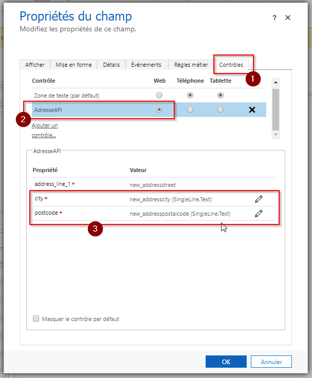

<https://learn.microsoft.com/en-us/power-apps/developer/component-framework/create-custom-controls-using-pcf>

https://dianabirkelbach.wordpress.com/2020/04/28/pcf-solution-packaging-unmanaged-production-release/

# LEI API

## Disclamor

The component is intended to integrate with with gleif.org's services. You may use the API (Application Programming Interface) only for lawful purposes and in compliance with all applicable laws and regulations.

<https://github.com/FrederickGrobost/PCF-Pappers-autocomplete/blob/main/ICKPappers/index.ts>
<https://github.com/AndrewButenko/GoogleAddressAutocomplete_PCF/blob/master/AddressAutocomplete/index.ts>
<https://github.com/waretec-it/google-places-autocomplete>
Installation step by step : 

1. Import the managed solution contains in "AddressAPI_Solution\bin\Release\AddressAPI_Solution.zip" on your CRM  
2. Open the form on which you want add the PCF  
3. Select the field corresponding to the street of the address to configure the PCF  
4. On the tab "Control" add the PCF and select in which case you want display it  
5. Below you need to select fields corresponding to the postal code and the city  
6. Publish  

## Debugg

https://learn.microsoft.com/en-us/power-apps/developer/component-framework/debugging-custom-controls

## Demo 

